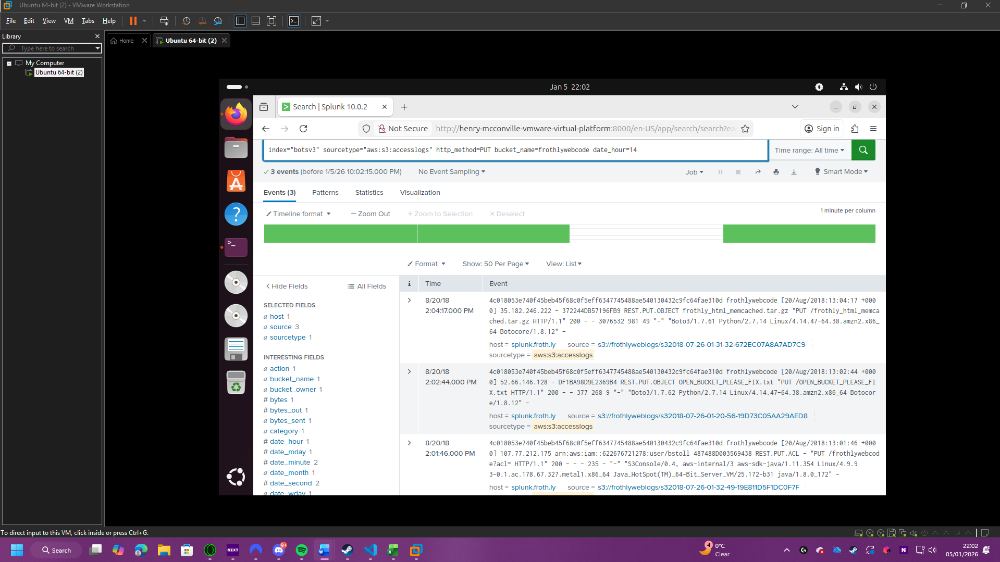

# Cyber Incident Investigation: Splunk BOTSv3 (Frothly Breach)
**Author:** Henry McConville

**Module:** COMP3010 Security Operations & Incident Management

**Dataset:** Splunk Boss of the SOC (BOTSv3)

## 1. Introduction
This report documents a forensic investigation using the Boss of the SOC (BOTS) v3 dataset within a Splunk environment. The scenario involves a targeted attack against Frothly, a functional brewing company.

Objectives:
-	To identify the scope of the compromise and the tactics, techniques, and procedures (TTPs) used by the adversary.
-	To demonstrate proficiency in Splunk SPL (Search Processing Language) for incident detection.

Scope & Assumptions:
-	Scope: Analysis is limited to the BOTSv3 dataset, focusing on network traffic, endpoint logs, and web server telemetry.
-	Assumptions: It is assumed that the SOC has baseline visibility into the Frothly network. While some data normalisation (Add-ons) was finalised during the investigation, the underlying raw telemetry is assumed to be integral and accurate.

## 2. SOC Roles & Incident Handling Reflection

This report simulates the workflow of a Tier 2 SOC Analyst within the context of the BOTSv3 exercise. While a Tier 1 Analyst typically handles initial alert triage, the scope of this task requires deep-dive investigation and cross-platform correlation to address specific security breaches. The primary objective of this investigative phase is to identify an unauthorised public S3 bucket, assess the resulting data exposure or 'damage,' and perform identity attribution to determine which user initiated the misconfiguration. By linking AWS CloudTrail telemetry with Windows endpoint logs, this report demonstrates the analytical process required to reconstruct a complex attack timeline across a hybrid infrastructure.

This investigation follows the NCSC Incident Management lifecycle, specifically focusing on the Detect and Analyse stages. From a regulatory perspective in the UK, the discovery of a public S3 bucket is a high-priority incident due to potential GDPR implications regarding data exposure. By utilising Splunk to combine CloudTrail and Windows logs to detect which user created this public S3 bucket and what device this was done on, the SOC can move beyond simple detection to gain a comprehensive understanding of the attack’s scope. The NCSC emphasises that effective analysis is a prerequisite for proportionate mitigation; by correctly identifying the root cause in the development pipeline, the SOC can avoid "blanket" shutdowns and instead focus on precise containment measures.

Applying the NCSC’s "10 Steps to Cyber Security," this incident reveals a critical failure in Identity and Access Management and Secure Configuration. For the Response phase, immediate containment should involve revoking the leaked IAM credentials and isolating the bstoll workstation to halt activity still active on the workstation. Looking toward Recovery and Prevention, the SOC must facilitate a "Lessons Learned" review to address the underlying policy breach. Recommendations would include implementing automated secret scanning to prevent hardcoded keys from reaching GitHub and enforcing the Principle of Least Privilege to ensure that accidental misconfigurations by single users cannot expose the entire organisation's attack surface.

## 3. Installation & Data Preparation

*Figure 1: Extracting the Splunk tarball on Ubuntu.*

The Splunk instance was deployed on Ubuntu Linux. This choice was made to align with professional SOC infrastructure standards, prioritizing resource efficiency and security. Unlike a Windows deployment, a "headless" Linux distribution significantly reduces resource overhead, ensuring that system memory is dedicated to indexing and searching rather than a GUI. From a security perspective, using a minimal Linux distro adheres to the NCSC principle of reducing the attack surface by eliminating unnecessary default applications and services.

The installation was performed using the .tgz archive. This method was selected over automated installers (like .deb or .rpm) to allow for more control over the installation directory and file permissions. In a SOC environment, this manual approach ensures that Splunk operates within a dedicated user space, adhering to the Principle of Least Privilege by not requiring root-level access for standard operations.

*Figure 2: Confirmation of splunk running.*

Figure 2 confirms that the Splunk Enterprise service is successfully initialised and the web interface is reachable. Validation was performed by launching the application in the browser and logging in. This step is critical in SOC preparation to ensure the SIEM is ready to ingest telemetry before any data is piped into the system.

*Figure 3: Data Summary showing the populated botsv3 index.*

Figure 3 confirms the successful ingestion of the BOTSv3 dataset by demonstrating that the botsv3 index is populated and contains the expected volume of events. Validating the presence of this raw telemetry is a critical baseline step in the NCSC 'Logging and Monitoring' lifecycle. While this confirms the data is physically present within the SIEM, it also establishes the necessary environment for Technology Add-ons to begin parsing the raw logs into structured fields. Ensuring the index is fully populated is a prerequisite for the subsequent analytical phase, where these fields will be used to correlate activity across AWS and Windows sources.

## 4. Guided Investigation: Analysis and Timeline of Events

This investigation follows a chronological timeline, moving from a baseline audit of the Frothly environment to the identification and attribution of a specific security breach.

### Stage 1: Security Posture & Baseline Audit
The investigation commenced by establishing a baseline of the environment’s identity and hardware assets to identify deviations from normal operations.

*Figure 4: Initial audit of IAM users within the AWS environment.*

To establish an inventory of active identities, a search was conducted on AWS CloudTrail logs in Figure 4. Identifying the total number of IAM users is a prerequisite for detecting "Dormant Accounts" or "Ghost Identities" that could be leveraged by an adversary. 

*Figure 5: Reviewing MFA logs to assess security posture.*

An audit of Multi-Factor Authentication (MFA) usage, seen in Figure 5, revealed a Critical Control Failure. The absence of MFA across active accounts represents a violation of the NCSC 'Identity and Access Management' principle. This vulnerability likely served as the primary entry vector for the threat actor, as it allowed for credential-based access without a second layer of verification.

*Figure 6: Documentation of web server hardware specifications.*

Figure 6 identifies the specific configuration of the cloud asset hosting the exposed code repository. Within a SOC environment, documenting the hardware profile of an affected system is a critical component of Asset Management. This ensures the investigation is accurately targeted toward the production web infrastructure and provides the necessary context to assess the potential impact of unauthorized access by the bstoll account.

---

### Stage 2: Incident Identification (The Cloud Breach)
Following the baseline audit, a specific unauthorized modification of cloud storage permissions was detected.

*Figure 7: The "Smoking Gun"—S3 ACL Modification.*

Figure 7 captures the critical PutBucketAcl events. By correlating the "Opening" event (2:01:46 PM) with the "Closing" event (2:57:54 PM), the Window of Exposure was determined to be approximately 56 minutes. This chronological data is vital for assessing the potential volume of data exfiltration or unauthorised access.

*Figure 8: Identity Attribution for user 'bstoll'.*

Analysis of the PutBucketAcl event (Figure 8) attributes the unauthorised permission change to the IAM user bstoll. This confirms that the breach was not an external automated scan but an action performed using valid (though likely compromised) internal credentials.

*Figure 9: Identification of the affected asset: 'frothlywebcode'.*

Figure 9 pinpoints the target: the frothlywebcode S3 bucket. Given this bucket contains production web code, the incident was escalated from a simple configuration error to a potential software supply-chain compromise.

---

### Stage 3: Impact Assessment & Endpoint Correlation
The investigation concluded by assessing the specific unauthorized activity and pivoting to the physical source of the breach.

*Figure 10: Detection of 'OPEN_BUCKET_PLEASE_FIX.txt'.*

Figure 10 reveals a file upload titled OPEN_BUCKET_PLEASE_FIX.txt. This represents an external notification (often referred to as "grey-hat" or "white-hat" reporting) in which a third party discovered the public bucket and notified the administrator. While non-malicious, it confirms that external scanners actively indexed the bucket.

*Figure 11: Malicious payload upload - 'frothly_html_memcached.tar.gz'.*

Unlike the previous notification, Figure 11 shows a suspicious upload of a compressed archive. While the name mimics a legitimate system file, its upload by bstoll during the window of exposure suggests a Persistence or Lateral Movement attempt. This is flagged as the primary malicious payload of the breach.

*Figure 12: Pivot from Cloud logs to Endpoint telemetry.*

To identify the physical origin of the bstoll activity, the investigation pivoted to Windows WinHostMon data, seen in Figure 12. This step is crucial for moving the investigation from the cloud infrastructure to the compromised physical asset.

*Figure 13: Final confirmation of the FQDN (BSTOLL-L.froth.ly).*

Figure 13 provides the Fully Qualified Domain Name (FQDN) of the endpoint: BSTOLL-L.froth.ly. This identification is the final step in the "Detect and Analyse" phase, providing the SOC with the precise network location required to perform Containment—isolating the host to prevent further lateral movement.

## 5. Conclusion
### Summary of Findings
The investigation into the Frothly environment successfully identified a high-severity security breach originating from the compromised IAM account of Bud Stoll (bstoll). The timeline of events confirms a Window of Exposure of approximately 56 minutes, during which the frothlywebcode S3 bucket was transitioned to a public state via an unauthorized Access Control List (ACL) modification.

This exposure led to the successful upload of a suspicious archive, frothly_html_memcached.tar.gz, indicating a potential attempt at persistence or code injection within the production web environment. By pivoting from cloud-native logs to endpoint telemetry, the investigation attributed this activity to the physical workstation BSTOLL-L.froth.ly, providing the necessary intelligence for host isolation and containment.

### Key Lessons and SOC Strategy Implications
This incident highlights a significant failure in Identity and Access Management (IAM) and Secure Configuration, both of which are core pillars of the NCSC’s security frameworks.
-	**The Criticality of MFA:** The primary security gap was the absence of Multi-Factor Authentication (MFA) across the AWS environment. Had MFA been enforced, it is highly probable that the initial credential compromise would have been thwarted, preventing the unauthorized cloud access entirely.
-	**The "Least Privilege" Gap:** The user bstoll possessed permissions sufficient to modify global bucket ACLs. This indicates a violation of the Principle of Least Privilege (PoLP); developer accounts should not have the authority to change production environment visibility without a formal change management process or multi-party authorization.

### Proposed Improvements for Detection and Response
To enhance the organization’s resilience and reduce the response time for future incidents, the following strategic improvements are recommended:
-	**Automated Real-Time Detection:** Splunk should be configured with a real-time correlation search targeting the PutBucketAcl event where the AllUsers or AuthenticatedUsers grantee is present. This would shift the SOC from a reactive "discovery" posture to an active "alerting" posture.
-	**Automated Remediation (SOAR):** Implementing a Security Orchestration, Automation, and Response (SOAR) playbook could allow the environment to automatically revert unauthorized ACL changes the moment they are detected, effectively reducing the window of exposure from minutes to seconds.
-	**Secrets Management:** A strict policy against hardcoding IAM credentials in code repositories must be enforced, supported by automated pre-commit scanning tools (such as GitGuardian or AWS Secrets Manager) to prevent keys from being leaked in the first place.

## 6. References
[1] NCSC, "10 Steps to Cyber Security," National Cyber Security Centre, 2023. [Online]. Available: https://www.ncsc.gov.uk/collection/10-steps.

[2] Splunk, "Boss of the SOC Version 3 Dataset," Splunk Inc., 2019. [Online]. Available: https://github.com/splunk/botsv3.

[3] NCSC, "Incident Management Lifecycle," National Cyber Security Centre, 2022. [Online]. Available: https://www.ncsc.gov.uk/collection/incident-management.

