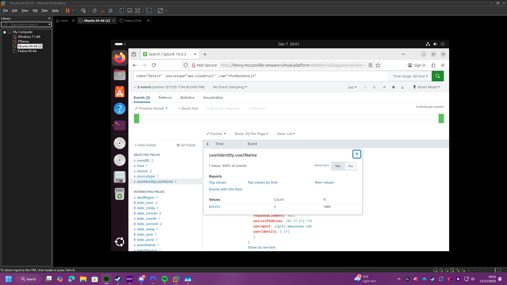
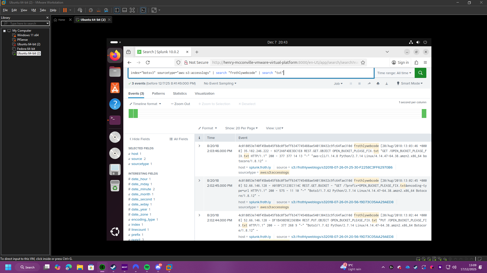
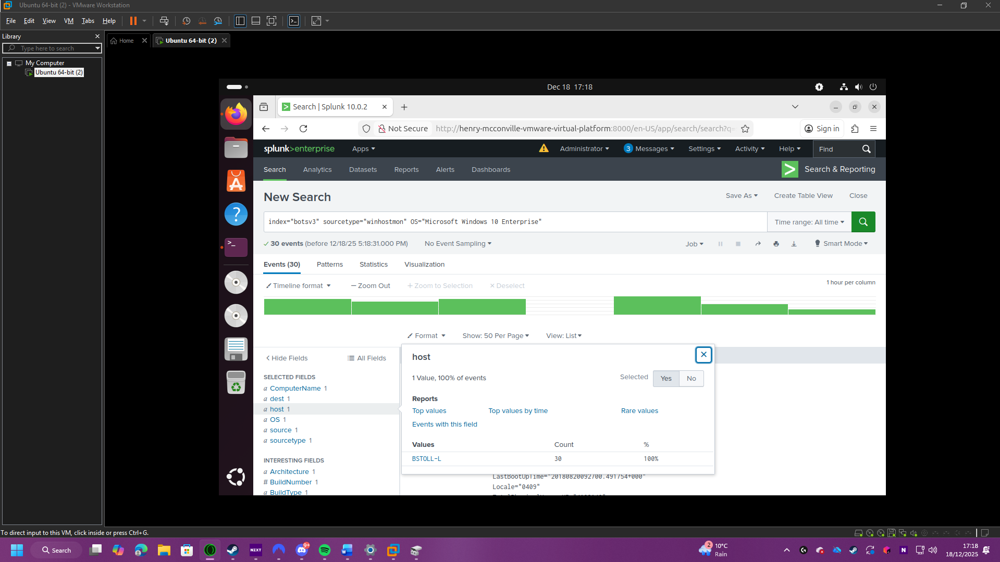

# BOTsv3-comp-3010
Github for Henry McConville comp 3010 assignment on the splunk BOTsv3 database

Introduction

This report details a forensic investigation into the Frothly food and beverage corporation, utilising the Splunk Boss of the SOC (BOTSv3) dataset. The scope of this analysis focuses on the hybrid infrastructure, bringing cloud assets and on-premises endpoints. The key telemetry sources include:
-	AWS: cloudtrial and S3 access logs track identity management and storage exposures.
-	Windows: WinHostMon logs to analyse physical system configurations and hardware-level persistence.

The primary objective is to reconstruct the attack lifecycle. Specifically, this investigation aims to:
-	Identify any vulnerabilities.
-	Assess the impact of the damage done.
-	Provide a recovery roadmap to heal and make the environment stronger.

This investigation is limited to a small part of the BOTSv3 dataset, mainly activity around and related to the user bstoll. It is assumed that all the logs provided in the Splunk index are authentic and that the timestamps are synchronised across both AWS and Windows environments to allow for accurate chronological correlation. And certain parts of the dataset requires specific add-ons to function.

SOC Roles & Incident Handling Reflection

This report simulates the workflow of a Tier 2 SOC Analyst within the context of the BOTSv3 exercise. While a Tier 1 Analyst typically handles initial alert triage, the scope of this task requires deep-dive investigation and cross-platform correlation to address specific security breaches. The primary objective of this investigative phase is to identify an unauthorised public S3 bucket, assess the resulting data exposure or 'damage,' and perform identity attribution to determine which user initiated the misconfiguration. By linking AWS CloudTrail telemetry with Windows endpoint logs, this report demonstrates the analytical process required to reconstruct a complex attack timeline across a hybrid infrastructure.

This investigation follows the NCSC Incident Management lifecycle, specifically focusing on the Detect and Analyse stages. From a regulatory perspective in the UK, the discovery of a public S3 bucket is a high-priority incident due to potential GDPR implications regarding data exposure. By utilising Splunk to combine CloudTrail and Windows logs to detect which user created this public S3 bucket and what device this was done on, the SOC can move beyond simple detection to gain a comprehensive understanding of the attack’s scope. The NCSC emphasises that effective analysis is a prerequisite for proportionate mitigation; by correctly identifying the root cause in the development pipeline, the SOC can avoid "blanket" shutdowns and instead focus on precise containment measures.

Applying the NCSC’s "10 Steps to Cyber Security," this incident reveals a critical failure in Identity and Access Management and Secure Configuration. For the Response phase, immediate containment should involve revoking the leaked IAM credentials and isolating the bstoll workstation to halt activity still active on the workstation. Looking toward Recovery and Prevention, the SOC must facilitate a "Lessons Learned" review to address the underlying policy breach. Recommendations would include implementing automated secret scanning to prevent hardcoded keys from reaching GitHub and enforcing the Principle of Least Privilege to ensure that accidental misconfigurations by single users cannot expose the entire organisation's attack surface.

Installation & Data Preparation

*Figure 1: Extracting the Splunk tarball on Ubuntu.*

The Splunk instance was deployed on Ubuntu Linux. This choice was made to align with professional SOC infrastructure standards, prioritizing resource efficiency and security. Unlike a Windows deployment, a "headless" Linux distribution significantly reduces resource overhead, ensuring that system memory is dedicated to indexing and searching rather than a GUI. From a security perspective, using a minimal Linux distro adheres to the NCSC principle of reducing the attack surface by eliminating unnecessary default applications and services.

The installation was performed using the .tgz archive. This method was selected over automated installers (like .deb or .rpm) to allow for more control over the installation directory and file permissions. In a SOC environment, this manual approach ensures that Splunk operates within a dedicated user space, adhering to the Principle of Least Privilege by not requiring root-level access for standard operations.

*Figure 2: Confirmation of splunk running.*

Figure 2 confirms that the Splunk Enterprise service is successfully initialised and the web interface is reachable. Validation was performed by launching the application in the browser and logging in. This step is critical in SOC preparation to ensure the SIEM is ready to ingest telemetry before any data is piped into the system.

*Figure 3: Data Summary showing the populated botsv3 index.*

Figure 3 confirms the successful ingestion of the BOTSv3 dataset by demonstrating that the botsv3 index is populated and contains the expected volume of events. Validating the presence of this raw telemetry is a critical baseline step in the NCSC 'Logging and Monitoring' lifecycle. While this confirms the data is physically present within the SIEM, it also establishes the necessary environment for Technology Add-ons to begin parsing the raw logs into structured fields. Ensuring the index is fully populated is a prerequisite for the subsequent analytical phase, where these fields will be used to correlate activity across AWS and Windows sources.

Guided Questions

*Figure 4: A comprehensive list of IAM users extracted from AWS CloudTrail logs to establish an identity baseline.*

*Figure 5: Identification of Multi-Factor Authentication (MFA) login events used to verify account security posture.*

*Figure 6: Detailed hardware specifications for the web server, providing a baseline for performance monitoring.*

*Figure 7: Splunk search results showing the Access Control List (ACL) changes that allowed the S3 bucket to become public.*

*Figure 8: Forensic evidence identifying 'bstoll' as the account associated with the unauthorized configuration changes.*

*Figure 9: Identification of the specific S3 bucket (frothlywebcode) that was exposed to the public internet.*

*Figure 10: Detection of the specific file uploaded to the compromised bucket during the window of exposure.*

*Figure 11: Confirmation of the local host name for the physical endpoint associated with the user bstoll.*

*Figure 12: The Fully Qualified Domain Name (FQDN) of the endpoint, providing the precise network location for incident containment.*

Conclusions

References
